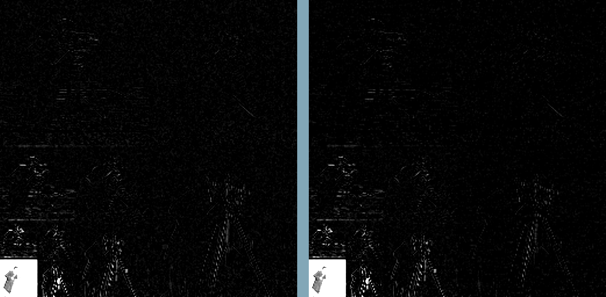

<h1>Discrete Wavelet Transform</h1>


<h2>DWT function calls, example with db2 wavelet: </h2>

GetFilter takes in variable number of analysis lowpass filter and computes the rest at compile time. Program uses Quadriture mirror filter pairs. The h00 and g00, low pass analysis and synthesis filters respectively are reverses of each other, and the same relationship applies for h11 and g11, high pass analysis and synthesis filters respectively, they are also derived from h00 but with sign alternation :
```cpp
...
constexpr GetFilter filter_vals{ 0.4829629131f, 0.8365163037f, 0.224143868f, -0.1294095226f };
...
```

##The arguments for DiscreteWaveletTransform constructor :

```cpp
...
std::array<float, 4> h00 = filter_vals.h0;
std::array<float, 4> h11 = filter_vals.h1_w;
std::array<float, 4> g00 = filter_vals.g0_w;
std::array<float, 4> g11 = filter_vals.g1_w;
int img_width = 256; // (for now the program requires the image to have dimensions 256x256).


DiscreteWaveletTransform w0{ 256, h00, h11, g00, g11 }; //img_width, analysis_low_pass, analysis_high_pass, synthesis_low_pass, synthesis_high_pass
...
```
To perform DWT call do_DWT trough the w0 object and specify the input image texture, buffer texture and the level of decomposition:
```cpp
...
w0.do_DWT(image_0, buff_tex, 1); //for level 1 dwt_output, buffer_texture, lvl_decomp
w0.do_DWT(image_0, buff_tex, 2); //for level 2 dwt_output, buffer_texture, lvl_decomp
w0.do_DWT(image_0, buff_tex, 3); //for level 3 dwt_output, buffer_texture, lvl_decomp
...
```


The program can apply denoising with soft thresholding to partitions of the image separately by computing a separate threshold for each.
To obtain the threshold one of the parameters needed is the median value of a DWT subband. To get it, DWT coefficients have to be sorted.
The program uses parallel bitonic sort and based on the number of given partitions stops the sorting. This is done by [Sort_subband_LOCAL_DYNAMIC.glsl](Compute_shaders/Sort_subband_LOCAL_DYNAMIC.glsl).

## Sorting can by done by call:

```cpp
...
w0.sort_subbands(image_0, sft_1, 1, 16); // input_img, sorted_subband_texture, lvl_decomp, num_partitions
...
```


The rest of the necessary computations like estimated variance of noise, standard deviation of the subband and threshold are computed in [Soft_threshold_DYNAMIC.glsl](Compute_shaders/Soft_threshold_DYNAMIC.glsl). All of these are obtained for each partition of a row of subband separately, while the scaling parameter is the same for all partitions but differs depending on the level.

##Method call to apply soft threshold :

```cpp
...
w0.apply_soft_threshold(image_0, sft_1, 1, 16);
...
```
<IMAGE OF DWT BEFORE AND AFTER SOFT THRESHOLD>


     
##To perform the inverse DWT the calls have to be made to the respective levels in reverse order:

```cpp
...
w0.do_IDWT(image_0, buff_tex, 3); //for level 3 dwt_output, buffer_texture, lvl_decomp
w0.do_IDWT(image_0, buff_tex, 2); //for level 2 dwt_output, buffer_texture, lvl_decomp
w0.do_IDWT(image_0, buff_tex, 1); //for level 1 dwt_output, buffer_texture, lvl_decomp
...
```
<IMAGE EXAMPLE OF DENOISED IDWT>

<h2>Initial implementation</h2>

Initially for dwt matrix was created as a texture from analysis low and high pass filters, then the inverse DWT matrix was generated by simply transposing the dwt matrix texture, because the Daubechies wavelets are orthogonal.


It is clear that to perform the convolution needed there are many redundant multiplications done if the image and the transform are multiplied element by element. The newer version of [apply_DWT_matrix_DYNAMIC.glsl](Compute_shaders/apply_DWT_matrix_DYNAMIC.glsl) [apply_IDWT_matrix_DYNAMIC.glsl](Compute_shaders/apply_IDWT_matrix_DYNAMIC.glsl) implementation uses sparse convolution to avoid redundant operations.

For example in the DWT each row has 128 threads if the width of subband is 128. One thread gathers the needed pixels based on the size of the filter, and performs the convolution for with low and high pass coefficients. For example threads with id 0 and db2 is the wavelet of choice :
the picked pixel indices are :

```glsl
...
for(int i = 0; i < 4; i++){
     int i_0 = (0 * 2 - i) % (256); // indeces i_0 = 0, i_1 = 255, i_2 = 254, i_3 = 253
     pix_low += imageLoad(image_O, ivec2(i_0, th_id.y)).x * h0[i];
     pix_high += imageLoad(image_O, ivec2(i_0, th_id.y)).x * h1[i];
}
...
```
pix_low and pix_high are then the outputs of convolution with low pass and high pass filters respectively.
Another perk of having the image with power of 2 dimensions is that the modulus operation can be implemented instead with & operator by using size_of_subband * 2 - 1 as a sort of a mask, so the above loop becomes :

```glsl
...
for(int i = 0; i < 4; i++){
     int i_0 = (0 * 2 - i) & (256 - 1); // indeces i_0 = 0, i_1 = 255, i_2 = 254, i_3 = 253
     pix_low += imageLoad(image_O, ivec2(i_0, th_id.y)).x * h0[i];
     pix_high += imageLoad(image_O, ivec2(i_0, th_id.y)).x * h1[i];
}
...
```

Similarly to C++ modulus with a negative number in glsl has to be done with ((index % 256) + 256 ) % 256 to get a positive value and using the AND bitwise operator is much less work.

##The inverse DWT :

The most basic approach the way it is shown in the filter bank diagrams, where each subband is upsampled and then convolved, transposed, convolved and transposed with its respective set of synthesis filters. For example upsampled HL subband has high pass filter and then lowpass filter applied. When these operations are applied to all of them, they are added together pixel by pixel. While this may not be the most efficient way to do that, personally, I wanted to see the exact diagrams of analysis and synthesis from all the articles and videos in action :


## Examples of different partition sizes used of denoising
Some levels are denoised better with higher number of partitions (which have to be a power of 2 since bitonic sort is used), for example level 1 decomposition has better results with 16 partitions with their respective local thresholds, while giving a higher number to higher levels results in
artefacts, because too much information is removed:

LEFT : denoising applied to levels : 1, 2, 3 with number of partitions 32, 8, 4, has very visible artefacts
RIGHT : denoising applied to levels : 1, 2 with number of partitions 16, 1 has a less damaged output

 


<h1> Bugs </h1>

<h2> Incorrect order of applying synthesis filters </h2>
<IMAGE OF ORDER OF FILTER CONVOLUTION BEING INCORRECT>


<h2> Not scaling the filter coefficients by sqrt(2) </h2>
If the filter values are obtained with the shift orthagonality condition SUM h0[n] * h0[n + 2k] = 2delta(k) , k = 0 to size_of_filter - 1 then coefficient sum is 2, however sum of the coeffiecients has to be sqrt(2). This is the result of not dividing all coefficients by sqrt(2):
If the approach in (https://www.dsprelated.com/showarticle/1006.php) is used to obtain the filter values, then the divsion is necessary otherwise it results in the example below.

<IMAGE OF NOT DIVIDING COEFFICIENTS BY SQRT(2)>

<h1>Dependencies</h1>

stb_image
stb_image_write
GLAD
GLFW
glm


