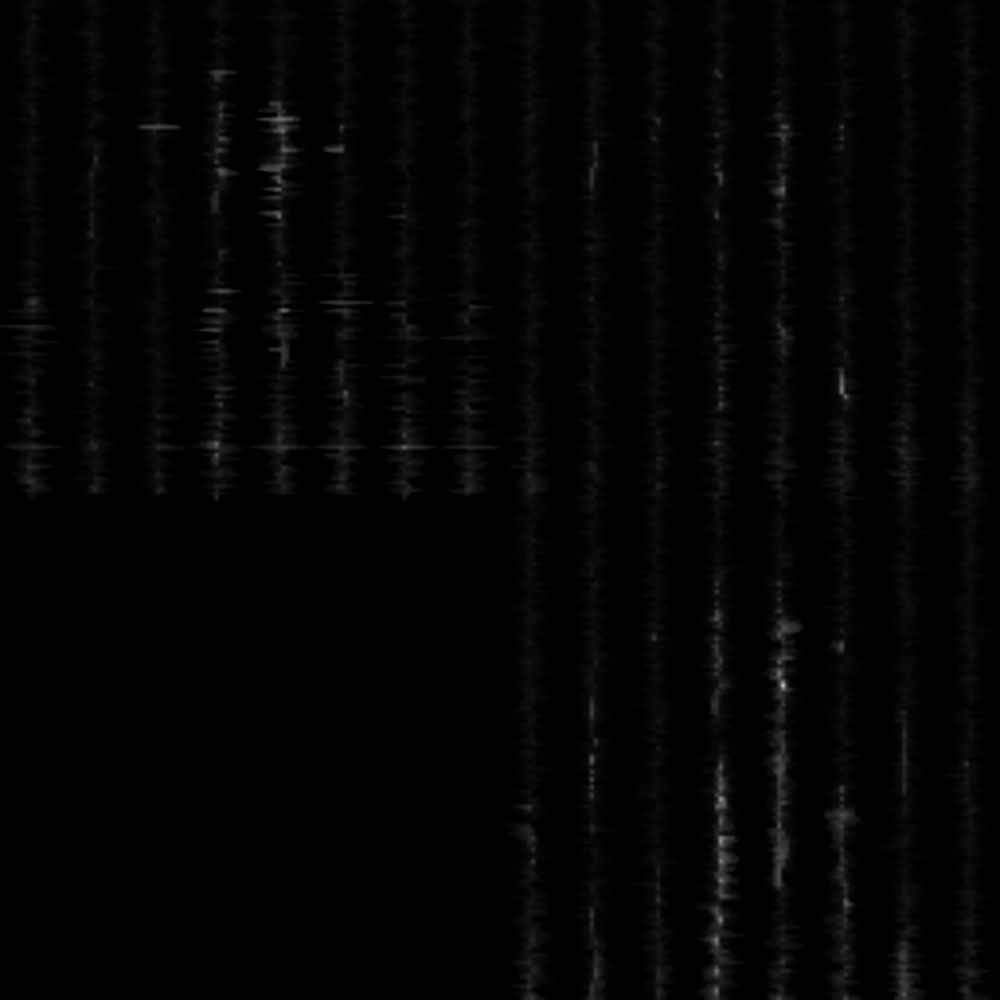
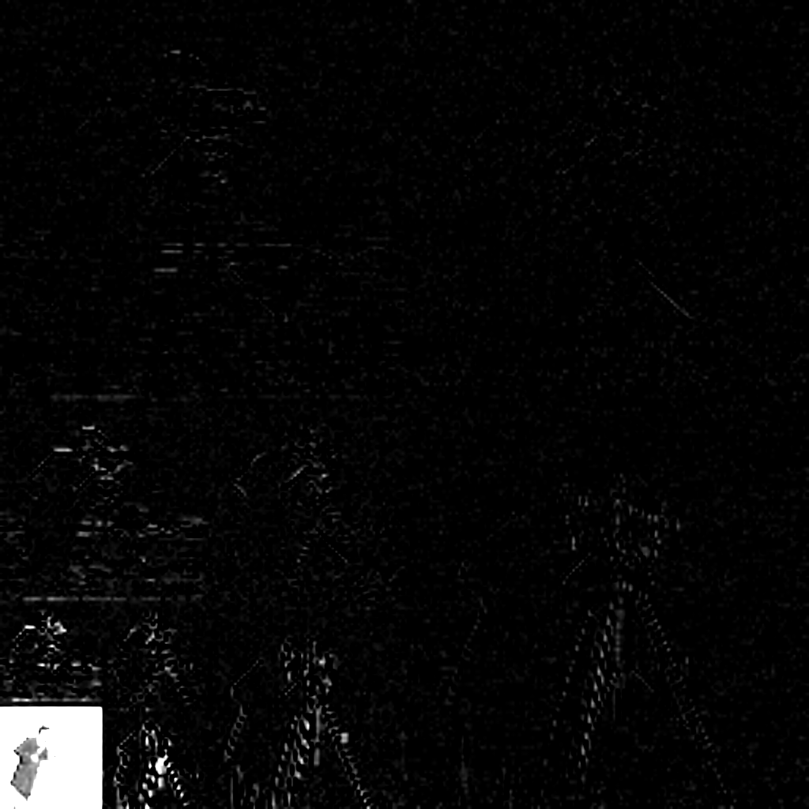
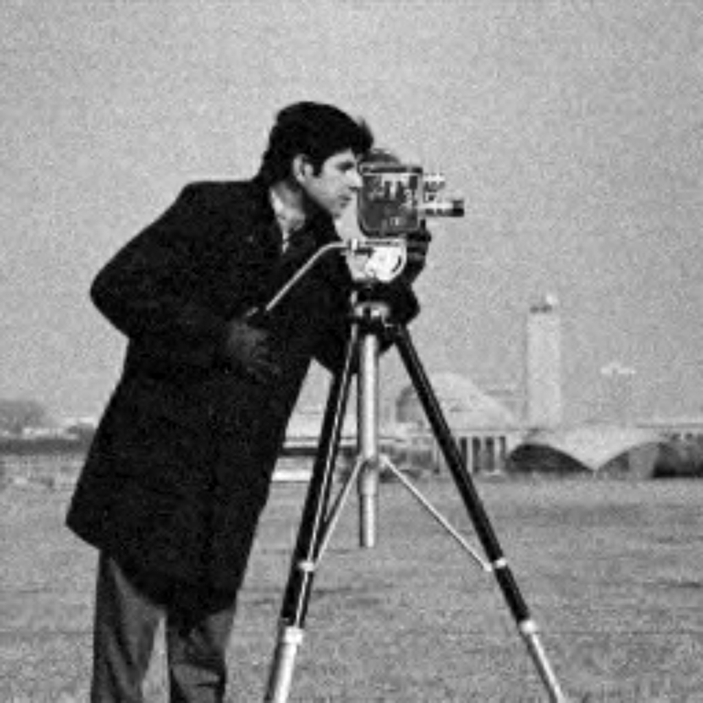
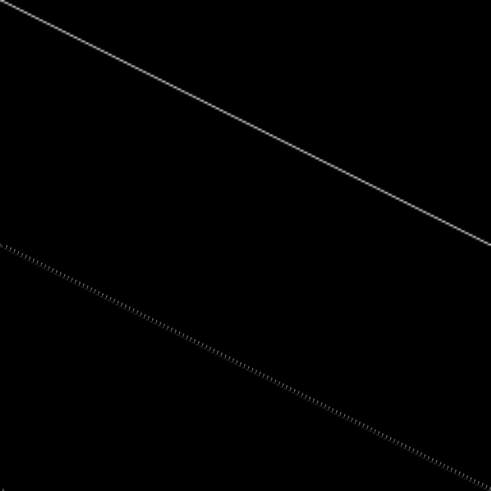
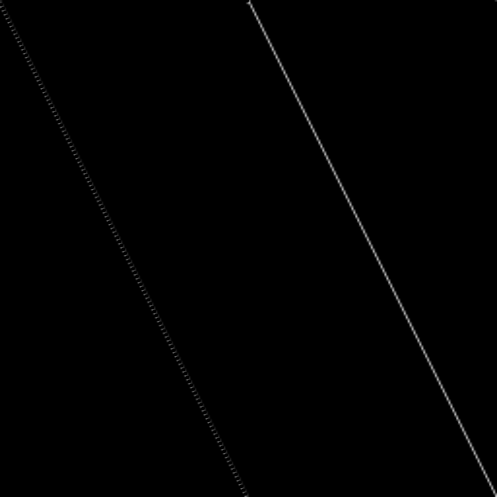
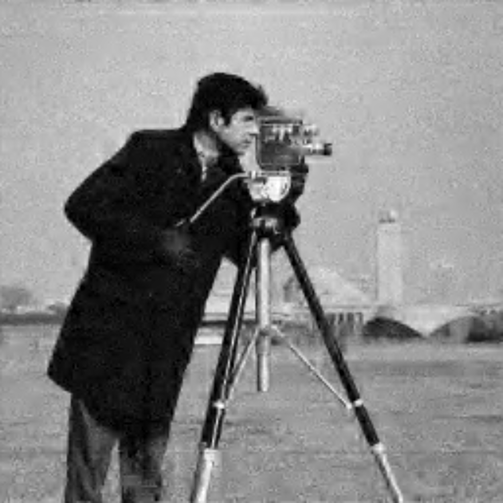
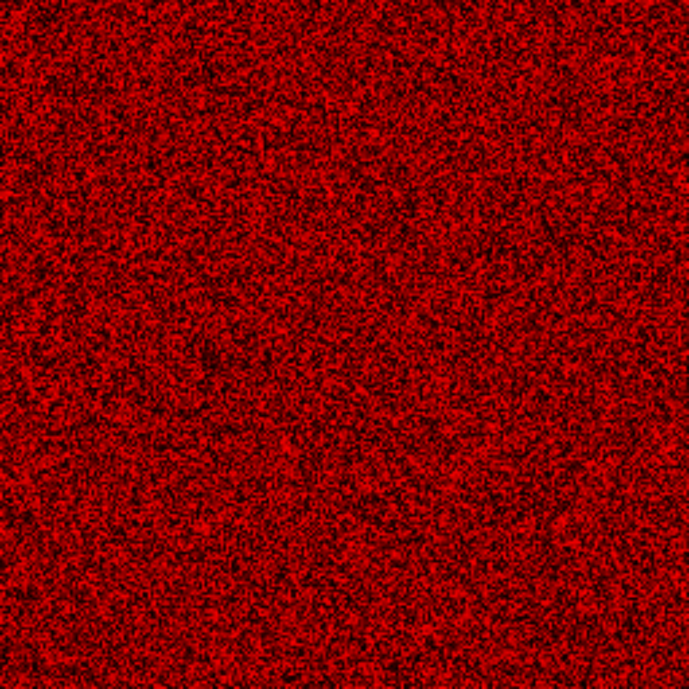
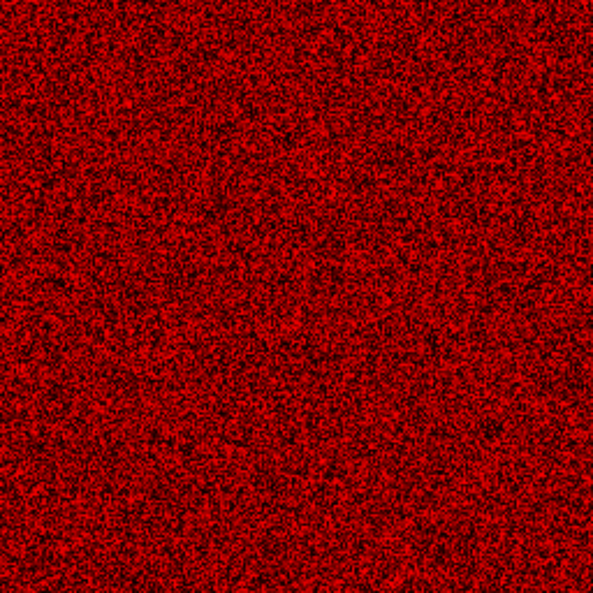
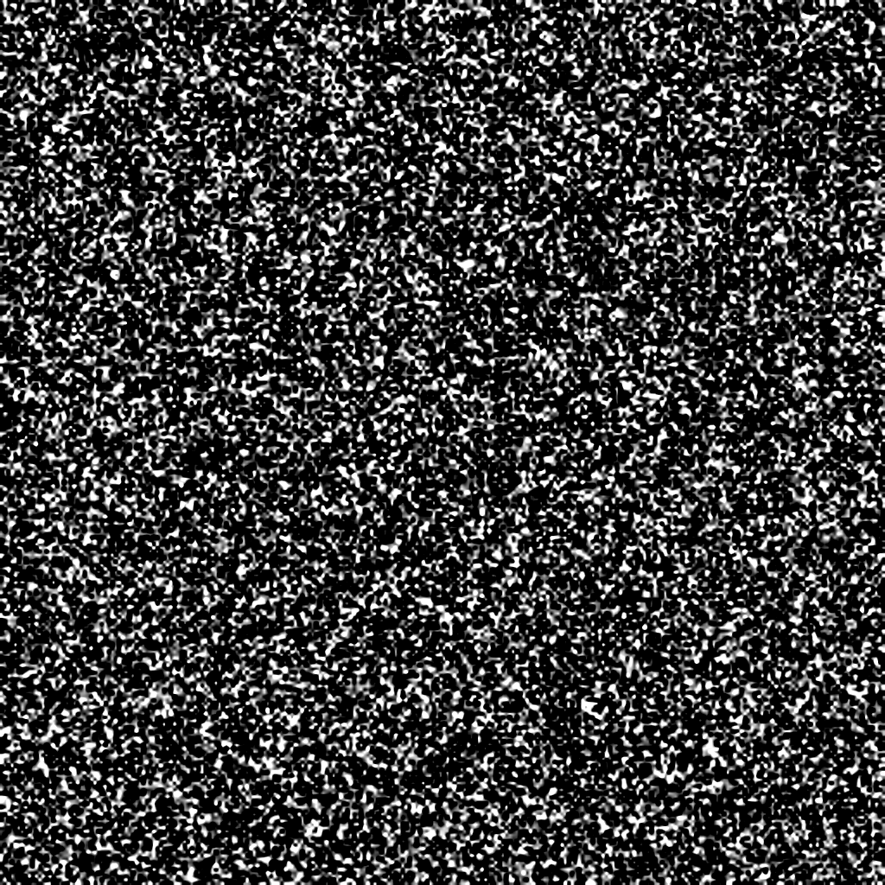
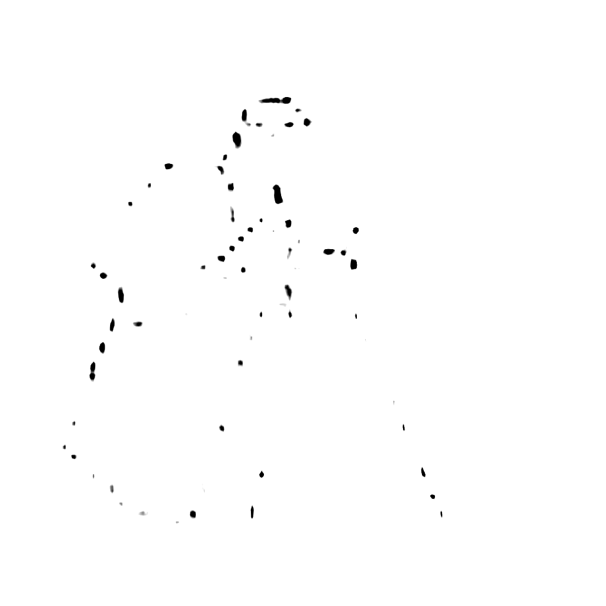

# 2D Discrete Wavelet Transform and Image Denoising Using Wavelet Thresholding 

<p align="center">

</p>

## DWT function calls, example with db2 wavelet: 

`GetFilter` class constructor takes in variable number of analysis low-pass filter coefficients and computes the rest at compile time. Program uses quadrature mirror filter pairs. The `h00` and `g00`, low-pass analysis and synthesis filters respectively are reverses of each other, and the same relationship applies for `h11` and `g11`, high-pass analysis and synthesis filters respectively, they are also derived from h00 but with sign alternation :

```cpp
...
constexpr GetFilter filter_vals{ 0.4829629131f, 0.8365163037f, 0.224143868f, -0.1294095226f };
...
```

### The arguments for `DiscreteWaveletTransform` constructor :

```cpp
...
std::array<float, 4> h00 = filter_vals.h0;
std::array<float, 4> h11 = filter_vals.h1_w;
std::array<float, 4> g00 = filter_vals.g0_w;
std::array<float, 4> g11 = filter_vals.g1_w;
int img_width = 256; // (for now the program requires the image to have dimensions 256x256).


DiscreteWaveletTransform w0{ 256, h00, h11, g00, g11 }; //img_width, analysis_low_pass, analysis_high_pass, synthesis_low_pass, synthesis_high_pass
...
```

### To perform DWT, call `do_DWT` trough the `w0` object and specify the input image texture, buffer texture and the level of decomposition:

```cpp
...
w0.do_DWT(image_0, buff_tex, 1); //for level 1 dwt_output, buffer_texture, lvl_decomp
w0.do_DWT(image_0, buff_tex, 2); //for level 2 dwt_output, buffer_texture, lvl_decomp
w0.do_DWT(image_0, buff_tex, 3); //for level 3 dwt_output, buffer_texture, lvl_decomp
...
```
<br>
<p align="center">

</p>

The program can apply denoising with soft thresholding to partitions of the image separately by computing a separate threshold for each.
To obtain the thresholds for the partitions one of the parameters needed is the median values for each partition. To obtain them, DWT coefficients have to be sorted.
The program uses parallel bitonic sort and based on the number of given partitions stops the sorting. This is done by [Sort_subband_LOCAL_DYNAMIC.glsl](https://github.com/tomsKalnins1/2D_DWT_with_OpenGL/blob/main/Compute_shaders/Sort_subband_LOCAL_DYNAMIC.glsl) .
<br clear="both">

### Sorting can by done with the call:

```cpp
...
w0.sort_subbands(image_0, sft_1, 1, 16); // input_img, sorted_subband_texture, lvl_decomp, num_partitions
...
```

The sorted subband coefficients: <br> <br>
<p align="center">

</p>
The rest of the necessary computations like estimated variance of noise, standard deviation of the subband and threshold are computed in [Soft_threshold_DYNAMIC.glsl](Compute_shaders/Soft_threshold_DYNAMIC.glsl). All of these are obtained for each partition of each subband row separately, while the scaling parameter is the same for all partitions but differs depending on the level. The formula used for computing the thresholds can be found here:
https://www.ee.iitb.ac.in/~icvgip/PAPERS/202.pdf

### Method call to apply soft thresholding :

```cpp
...
w0.apply_soft_threshold(image_0, sft_1, 1, 16);
...
```

LEFT : noisy DWT <br>
RIGHT : denoised DWT <br>
<p align="center">
 
</p>
     
### To perform the inverse DWT the calls have to be made to the respective levels in reverse order:

```cpp
...
w0.do_IDWT(image_0, buff_tex, 3); //for level 3 dwt_output, buffer_texture, lvl_decomp
w0.do_IDWT(image_0, buff_tex, 2); //for level 2 dwt_output, buffer_texture, lvl_decomp
w0.do_IDWT(image_0, buff_tex, 1); //for level 1 dwt_output, buffer_texture, lvl_decomp
...
```
LEFT : DWT input <br>
RIGHT : denoised IDWT output <br>
<p align="center">
 
</p>

## Initial implementation

The initial approach was to create a DWT matrix as a texture from analysis low and high pass filters, then the inverse DWT matrix was generated by simply transposing the DWT matrix texture, because the Daubechies wavelets are orthogonal.<br>
LEFT : DWT matrix <br>
RIGHT : IDWT matrix <br>
<p align="center">
 
</p>
It is clear that to perform the convolution needed, there are many redundant multiplications done, if the image and the transform are multiplied element by element. The newer implementation in  [apply_DWT_matrix_DYNAMIC.glsl](Compute_shaders/apply_DWT_matrix_DYNAMIC.glsl) and [apply_IDWT_matrix_DYNAMIC.glsl](Compute_shaders/apply_IDWT_matrix_DYNAMIC.glsl) uses sparse convolution to avoid redundant operations.
For example, in the level 1 DWT, each row has 128 threads if the width of subband is 128. One thread gathers only the needed pixels based on the size of the filter and the respective shift by 2, and performs the convolution with low and high pass coefficients, thread with id 0 and db2 being the wavelet of choice,
the picked pixel indices are :

```glsl
...
for(int i = 0; i < 4; i++){
     int i_0 = (0 * 2 - i) % (256); // indices i_0 = 0, 255, 254, 253 
     pix_low += imageLoad(image_O, ivec2(i_0, th_id.y)).x * h0[i];
     pix_high += imageLoad(image_O, ivec2(i_0, th_id.y)).x * h1[i];
}
...
```

pix_low and pix_high are then the outputs of convolution with low-pass and high-pass filters respectively.
Another advantage of having the image with power of 2 dimensions is that the modulus operation can be implemented instead with the & operator by using size_of_subband * 2 - 1 as a sort of a mask, so the above loop becomes :

```glsl
...
for(int i = 0; i < 4; i++){
     int i_0 = (0 * 2 - i) & (256 - 1); // indices i_0 = 0, 255, 254, 253
     pix_low += imageLoad(image_O, ivec2(i_0, th_id.y)).x * h0[i];
     pix_high += imageLoad(image_O, ivec2(i_0, th_id.y)).x * h1[i];
}
...
```

As in C++, GLSL's % operator with a negative dividend can produce a negative remainder. Therefore, in the first loop (0 * 2 - i) % 256 would produce the indices 0, -1, -2, -3, which are not suitable for circular indexing. In practice, ((index % 256) + 256) % 256 would be needed to obtain a positive wrapped index. For power-of-two dimensions, using the bitwise AND operation avoids this additional work.

### The inverse DWT :

The most basic approach, the way it is shown in the filter bank diagrams, where each subband is upsampled and then convolved, transposed, convolved and transposed with its respective set of synthesis filters. For example upsampled HL subband has high pass filter and then low-pass filter applied. When these operations are applied to all of them, they are added together pixel by pixel. While this may not be the most efficient way to do that, personally, I wanted to see this part from the DWT diagrams of analysis and synthesis from all the articles and videos in action :
<p align="center">

</p>

## Examples of different partition sizes used for denoising

Some levels are denoised better with a higher number of partitions (which have to be a power of 2 since bitonic sort is used), for example level 1 decomposition has better results with 16 partitions with their respective local thresholds, while giving a higher number of partitions for higher levels results in artefacts, because too much information is removed:

LEFT : denoising applied to levels : 1, 2, 3 with number of partitions 32, 8, 4, has very visible artefacts <br>
RIGHT : denoising applied to levels : 1, 2 with number of partitions 16, 1, has a less damaged output
<p align="center">
 
</p>

## Noise generation

The image had additive Gaussian noise applied to it:

```cpp
...
AddGaussianNoise::generate_uniform_noise(noise_u_0, 1); //args : Texture& noise_0, 
AddGaussianNoise::generate_uniform_noise(noise_u_1, 2);
AddGaussianNoise::apply_Gaussian_noise(noise_u_0, noise_u_1, image_0, AWGN, 0.04);
...
```

The Xoshiro_32 algorithm was used to obtain uniformly distributed `noise_u_0` and `noise_u_1` which then were used in the Box-Muller method to get the required noise:

```glsl
...
float noised = sqrt((-2.0) * log(n_0.x)) * cos(2.0 * pi * n_1.x);
...
```

<p align="center">
  
</p>

## Some of the bugs

### Incorrect order of applying synthesis filters 
Incorrect order of low/high pass filter application for LH and HL subbands.
<p align="center">

</p>

### Not scaling the filter coefficients by sqrt(2)

If the filter values are obtained with the shift orthogonality condition SUM h0[n] * h0[n + 2k] = 2delta(k) , k = 0 to size_of_filter - 1 then coefficient sum is 2, however sum of the coefficients has to be sqrt(2).
If the approach in (https://www.dsprelated.com/showarticle/1006.php) is used to obtain the filter values, then the division is necessary otherwise it results in the example below.<br>
This is the result of not dividing all coefficients by sqrt(2) :
<p align="center">

</p>

## Dependencies

* [stb_image](https://github.com/nothings/stb/blob/master/stb_image.h)
* [stb_image_write](https://github.com/nothings/stb/blob/master/stb_image_write.h)
* [GLAD](https://glad.dav1d.de/)
* [GLFW](https://www.glfw.org/)
* [glm](https://github.com/g-truc/glm)


